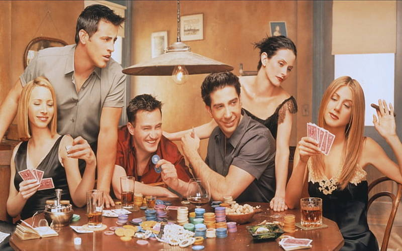

### ChandlerSaid ![alt text][1.2]
---

[](https://repl.it/github/thedhanawada/ChandlerSaid)



Me being an ardent fan of [FRIENDS](https://en.wikipedia.org/wiki/Friends) & [Chandler Bing](https://en.wikipedia.org/wiki/Chandler_Bing) (well, who isn't?) on one fine day, wanted to create twitter account that could keep tweeting every single line that [Chandler Bing](https://en.wikipedia.org/wiki/Chandler_Bing)  spoke on the show.

[This Twitter Handle](https://twitter.com/BingItDown) ![alt text][1.2] keeps tweeting once every 10 minutes with a random line of Chandler Bing.

Forever, if time could persist.

[1.1]: http://i.imgur.com/tXSoThF.png (twitter icon with padding)


[1.2]: http://i.imgur.com/wWzX9uB.png (twitter icon without padding)

### Run Locally
---
The Code is written in [Python](https://en.wikipedia.org/wiki/Python_(programming_language)). You need to [install](https://www.python.org/downloads/) all the dependencies of Python to get started. For the purpose of this application, you need to install [pip](https://en.wikipedia.org/wiki/Pip_(package_manager)) to install [dependencies](https://github.com/thedhanawada/ChandlerSaid/blob/master/requirements.txt) of this application

Install all the required dependencies with:

```
pip install requirements.txt
```
Later, simply run:

```
python twitter-post-status.py
```

### Hosting on a Server
---
This application is hosted on [Heroku](https://heroku.com). Simply, fork the project, edit the keys in the configuration file and deploy on Heroku. You must attach a [Heroku Scheduler](https://devcenter.heroku.com/articles/scheduler) with a 10 minute interval to keep this running for a specfic period of time.

### Configuring Twitter Keys
---
The [config.py](https://github.com/thedhanawada/ChandlerSaid/blob/master/config.py) file holds all the secret keys that lets the application interact and post messages on Twitter. You need to configure this file to let the application work. Get your own [Twitter Keys](https://developer.twitter.com)

### Data
---
Chandler's transcripts were scrapped from the main transcripts and was converted to [Google Sheets](https://www.google.com.au/sheets/about/) file and I connected [Sheety](https://sheety.co) to create an API. At the moment of creating this app, I had to use this to get the app off the ground. Be cautious, the future of the app might not rely on this particular service.

Here is the [link to the Sheety API](https://api.sheety.co/98b7e023de93d9f9c9e690887491f1d4/chandler/chandler) which, at the moment, is public for consumption. But, please be gentle.

I am looking forward to host my own api with all the data.

### Configuring Twitter Keys
---
* [twitter](https://pypi.org/project/twitter/)
* [termcolor](https://pypi.org/project/termcolor2/)
* [urllib3](https://pypi.org/project/urllib3/)

### Credits
---
* [Transcripts](https://fangj.github.io/friends/)
* [Header Image](https://www.wallpaperflare.com/search?wallpaper=chandler)
* Transcripts and names are copyrighted resources of the production house of  [FRIENDS](https://en.wikipedia.org/wiki/Friends)
* [GitSocial](https://github.com/carlsednaoui/gitsocial)
